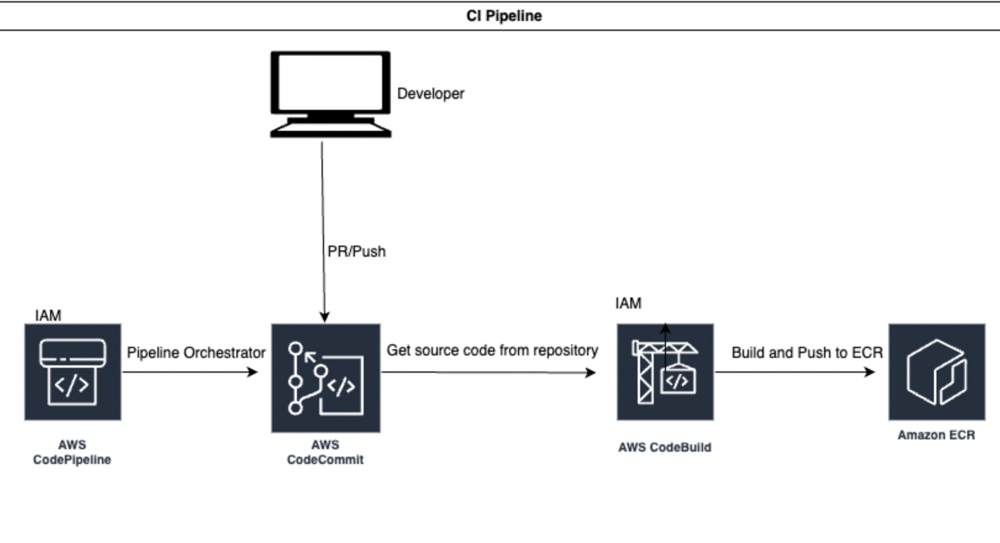

# Continuous Integration Automation (CIA).
## TASK
You’re a new engineer that has joined the platform team in a startup company. They are building out their new applications in the cloud as microservices. They want to decouple the CI pipelines. This means that each microservices will have its own independent pipeline. The lead architect has provided you with an architecture diagram as shown below that illustrates how each app’s CI system would be configured.
Your task is to follow the provided steps to manually create one of their microservices’ CI pipelines using AWS native tools. After that’s complete, you will create a terraform module that can be used for the other services.

Below is the architecture for the CI pipeline. You will create the resources manually using the following steps, then proceed to use terraform.





Before starting this exercise, make sure you're connected to the AWS account using an IAM user.
- On the AWS management console, under services, search “CodeCommit”.
- Find and click on “Create Repository”
- Enter  "web-app" as the repository name, a description, and click on “create”.
- You have now created the codecommit repository.

ECR
- Navigate to the ECR service.
- Create a repository called web-app.

CODEBUILD
- Go to IAM service
- Click create a role.
- For use-case, select CodeBuild.
- For permissions, select create policy.
- Add the following to the json policy.
  
```
{
    "Version": "2012-10-17",
    "Statement": [
        {
            "Effect": "Allow",
            "Resource": [
                "arn:aws:logs:us-east-1:721114834872:log-group:/aws/codebuild/web-app",
                "arn:aws:logs:us-east-1:721114834872:log-group:/aws/codebuild/web-app:*"
            ],
            "Action": [
                "logs:CreateLogGroup",
                "logs:CreateLogStream",
                "logs:PutLogEvents"
            ]
        },
        {
            "Effect": "Allow",
            "Resource": [
                "arn:aws:s3:::codepipeline-us-east-1-*"
            ],
            "Action": [
                "s3:PutObject",
                "s3:GetObject",
                "s3:GetObjectVersion",
                "s3:GetBucketAcl",
                "s3:GetBucketLocation"
            ]
        },
        {
            "Effect": "Allow",
            "Resource": [
                "*"
            ],
            "Action": [
                "ecr:*"
            ]
        },
        {
            "Effect": "Allow",
            "Resource": [
                "arn:aws:codecommit:us-east-1:721114834872:web-app"
            ],
            "Action": [
                "codecommit:GitPull"
            ]
        },
        {
            "Effect": "Allow",
            "Action": [
                "codebuild:CreateReportGroup",
                "codebuild:CreateReport",
                "codebuild:UpdateReport",
                "codebuild:BatchPutTestCases",
                "codebuild:BatchPutCodeCoverages"
            ],
            "Resource": [
                "arn:aws:codebuild:us-east-1:721114834872:report-group/web-app-*"
            ]
        }
    ]
}
```

- Give the name: code-build-policy. Click create policy.
- Go back and add the policy to the codebuild role.
- Click review and name the role code-build-role. Create the role.
- On the console, navigate to the CodeBuild service.
- On the management console, search and navigate to the CodeBuild service.
- Choose create build project.
- Enter “web-app” in the project name.
- For Source provider, select “AWS CodeCommit”
- Repository name is “web-app”. 
- Reference type is Branch.
- Branch is main.
- Environment is managed
- OS is Amazon Linux 2
- Runtime is Standard
- Image is x86_64-standard:3.0
- Tick Priviledged 
- Attach the code-build-ecs-role you created.
- Uncheck the option to modify the role.
- Choose “Use a buildspec file” in the build specifications.
- Leave everything else and create the build project.
- Go to IAM, add ecr full permission to the policy on the codebuild role for the ECR repository.

CodePipeline
- Navigate to the CodePipeline service and choose create pipeline.
- For pipeline name, enter web-app
- Choose new service role.
- Click next.
- Source provider is CodeCommit. Repository name is web-app and branch name is master and click next.
- Leave output artifact format as default and click next.
- Build provider is CodeBuild.
- Give the build project name and choose single build.
- Skip the deploy stage and create pipeline.

##VALIDATION AND TESTING
- Install git locally if you don't have it.
```
$ sudo yum install - git
```
- Generate SSH keys for the IAM user.
```
$ ssh-keygen -t rsa -b 4096
$ cat ~/.ssh/id_rsa.pub
```
- On the console, navigate to the IAM service. Under security credentials for the IAM user , select upload SSH public key.
- Paste what you have in the space provided and upload.
- After the upload, copy the SSH ID generated.
- Go back to your local computer.
- Create the config file that would be used to store credentials to authenticate with AWS Codecommit and give the file read permissions so that contents could be read and supplied to IAM for authentication.
```
$ touch ~/.ssh/config
$ chmod 600 ~/.ssh/config
```
- Run the following commands to put in the credentials in the config file. Remember, your-SSH-ID is what you copied after uploading the public keys to IAM.
```
$ echo "Host git-codecommit.*.amazonaws.com" > ~/.ssh/config
$ echo "User your-SSH-ID" >> ~/.ssh/config
$ echo "IdentityFile ~/.ssh/id_rsa" >> ~/.ssh/config
```
- Navigate to the CodeCommit service. 
- Select the repo you created and choose Clone URL. Copy the SSH URL shown.
- On your computer, run git clone “paste the URL”
- Run the following commands to get the source code for the application.
```
cd
git clone https://github.com/bmukum/august-2022-app.git
```
- copy the files into your repository.
```
cp -r august-2022-app/aws-cicid/* web-app
```
- Commit the changes, push them up and watch the pipeline execute.
- If it succeeds, you're all done. Bravo! You're done.


